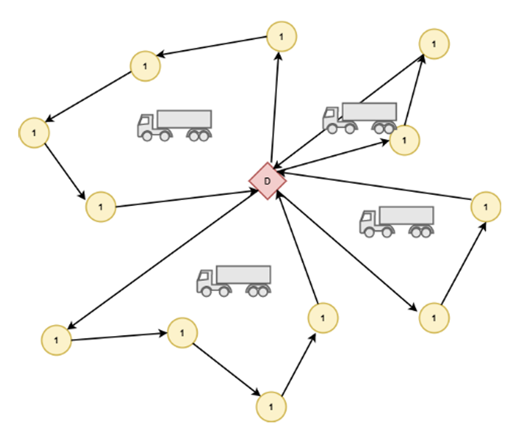

## Problem Statement

This project addresses a real-world optimization problem inspired by last-mile distribution logistics, a critical and cost-intensive component of modern supply chains. The problem studied is an extended variant of the Capacitated Vehicle Routing Problem (CVRP), enriched with additional operational and cost-related constraints.

A key feature of this problem is the simultaneous management of two distinct types of vehicles:

   - Long-term vehicles, whose fleet size and characteristics are fixed. These vehicles are designed to perform full daily routes, serving multiple customers in a single tour while respecting capacity, time, and distance constraints.
   - Short-term vehicles, which can be rented on demand at a higher fixed cost. These vehicles are used for specific point-to-point deliveries and are restricted to a single round trip (depot–customer–depot).

The objective is to minimize the total operational cost, which includes fixed vehicle usage costs as well as penalties associated with exceeding soft limits on route duration and distance. Each customer must be served exactly once, either by a long-term vehicle as part of a route or by a short-term vehicle through a dedicated trip.

Due to the NP-hard nature of the problem and the rapid growth in computational complexity as instance sizes increase, exact optimization methods become impractical for large-scale instances. As a result, the project combines exact mathematical programming (PLNE) for small to medium instances with a metaheuristic approach (Tabu Search) to efficiently address larger problem sizes.

## Project Workflow

1. **Mathematical Modeling**
   - Formulation of the CVRP variant with additional vehicle constraints.
   - Definition of variables, constraints, and objective function.

2. **Exact Implementation (IBM CPLEX)**
   - Model solved exactly on small to medium instances.
   - Provides baseline solutions and validation.

3. **Metaheuristic Approach (Tabu Search)**
   - Applied to larger instances where exact methods become computationally expensive.
   - Focus on solution quality and computation time trade-off.

  

